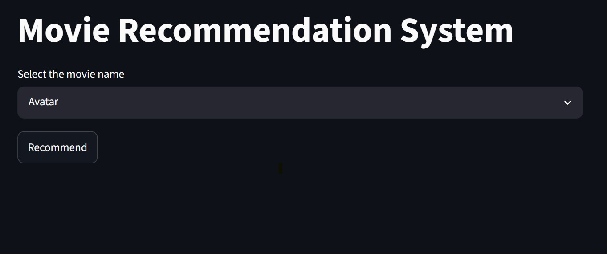
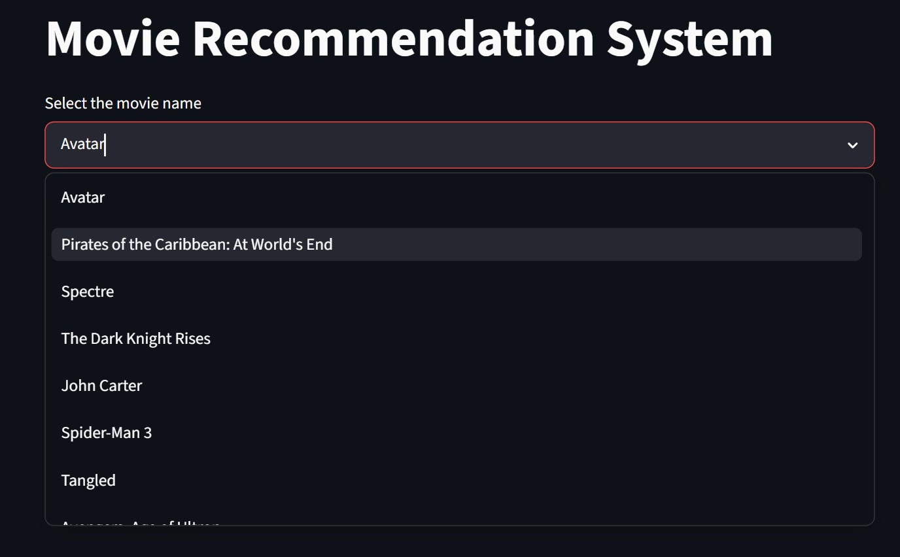
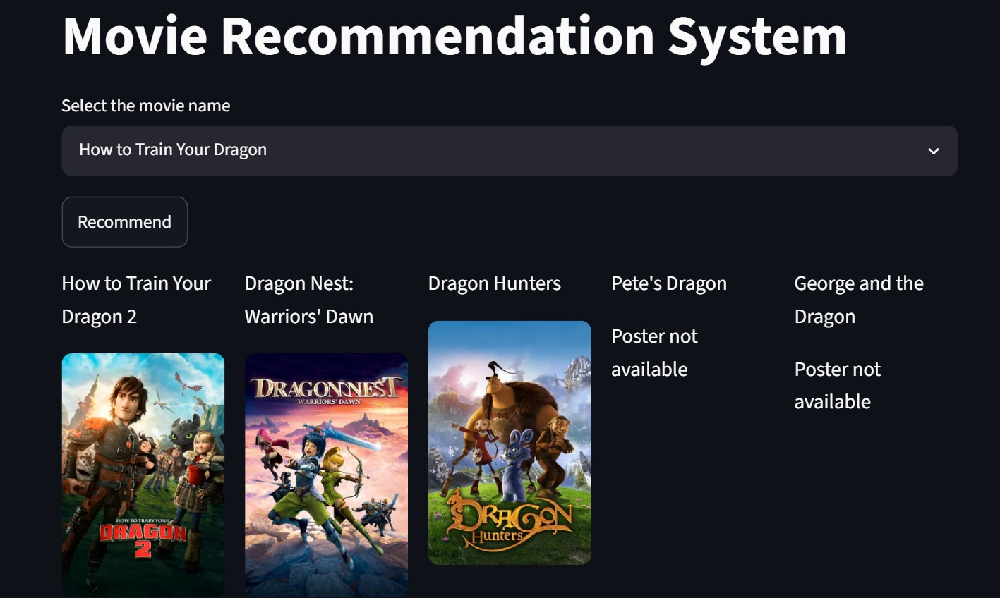

# 🎬 Movie Recommendation System

A content-based movie recommendation system built using **Python, Pandas, Scikit-learn, and Streamlit**. The application recommends movies similar to a selected movie by analyzing movie metadata and computing cosine similarity between feature vectors.

The system is integrated with the **TMDB API** to dynamically fetch movie posters and provide an interactive user experience.

---

## 🚀 Features

* Content-based movie recommendation
* Recommends movies similar to the selected movie
* Interactive web interface built with Streamlit
* Movie poster fetching using TMDB API
* Fast similarity search using precomputed similarity matrix
* Simple and user-friendly design

---

## 🛠️ Tech Stack

* Python
* Pandas
* NumPy
* Scikit-learn
* Streamlit
* TMDB API

---

## 📂 Project Structure

```text
Movie-Recommendation-System-Streamlit/
├── screenshots/
│   ├── dashboard.jpg
│   ├── movieDropdown.jpg
│   └── results.jpg
├── venv/
├── .gitignore
├── app.py
├── EDA_and_Preprocessing.py
├── TextVectorization.py
├── movies.pkl
├── similarity.pkl
├── requirements.txt
├── README.md
└── run.txt
```

### File Description

| File                       | Description                                     |
| -------------------------- | ----------------------------------------------- |
| `app.py`                   | Streamlit application for movie recommendations |
| `EDA_and_Preprocessing.py` | Data cleaning and preprocessing                 |
| `TextVectorization.py`     | Feature extraction and vectorization            |
| `movies.pkl`               | Processed movie dataset                         |
| `similarity.pkl`           | Precomputed cosine similarity matrix            |

---

## ⚙️ Installation

### 1. Clone the Repository

```bash
git clone https://github.com/<your-username>/Movie-Recommendation-System-Streamlit.git
cd Movie-Recommendation-System-Streamlit
```

### 2. Create Virtual Environment

```bash
python -m venv venv
```

### 3. Activate Virtual Environment

**Windows**

```bash
venv\Scripts\activate
```

**Linux / macOS**

```bash
source venv/bin/activate
```

### 4. Install Dependencies

```bash
pip install -r requirements.txt
```

---

## ▶️ Run the Application

```bash
streamlit run app.py
```

The application will open in your browser automatically.

---

## 🧠 How It Works

1. Movie metadata is collected and preprocessed.
2. Important features such as genres, keywords, cast, and crew are combined.
3. Text vectorization is performed using Scikit-learn.
4. Cosine similarity is calculated between movie vectors.
5. When a user selects a movie, the system finds the most similar movies and displays recommendations.
6. TMDB API is used to fetch movie posters dynamically.

---

## 📸 Screenshots

### Home Page

The application provides an intuitive interface for selecting movies and generating recommendations.



---

### Movie Selection

Users can search and select movies from the dropdown menu.



---

### Recommendation Results

The system displays the top recommended movies along with their posters fetched from the TMDB API.



---

## 📈 Future Improvements

* Hybrid recommendation system
* Collaborative filtering
* User authentication
* Movie ratings integration
* Deployment on cloud platforms
* Advanced filtering options

---


## 📄 License

This project is licensed under the MIT License.

---

## 👨‍💻 Author

**Shivam Sinha**

* GitHub: https://github.com/shivam3821
* LinkedIn: https://www.linkedin.com/in/shivamsinha0810/
